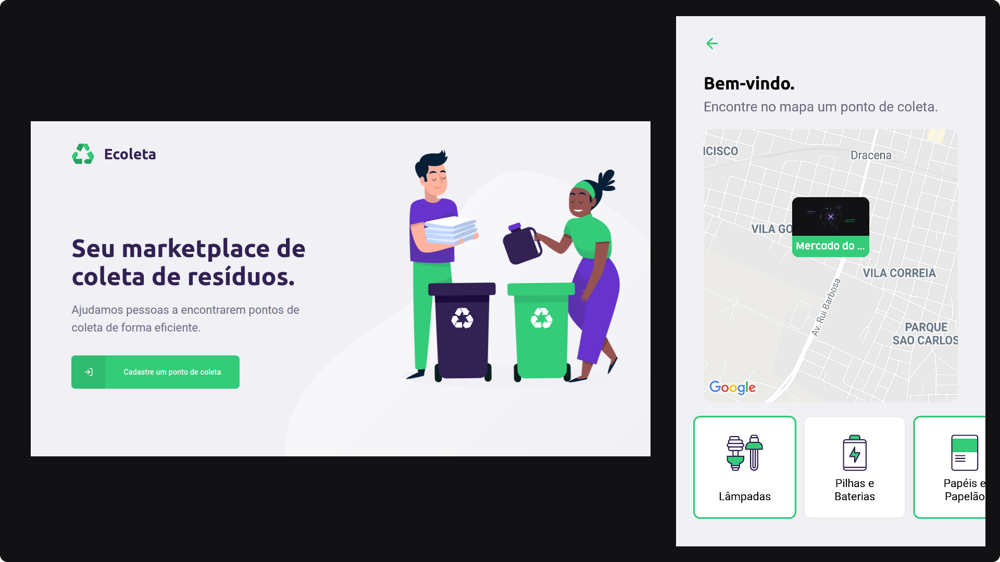

  

<h3 align="center">
  Find and advertise garbage collection locations
</h3>

  :coffee: Study full-stack application

  

  

  

---

## :recycle: About

The three applications (backend, web app and mobile app) were made on the Next Level Week, by [Rocketseat](https://rocketseat.com.br).

## :computer: Backend
 
A RESTful API created with [NodeJS](https://nodejs.org) and [Typescript](https://typescriptlang.com).

Main technologies implemented in backend:

|Name|Description|
|---|---|
|[Express](https://github.com/expressjs/express)|Standard server structure|
|[SQLite](https://github.com/sqlite/sqlite)|Embedded database|
|[Knex](https://github.com/knex/knex)|Query Builder|
|[Multer](https://github.com/expressjs/multer)|File upload middleware|
|[Celebrate](https://github.com/arb/celebrate)|Joi validation middleware|

## :computer: Web

A [React](https://reactjs.org) app with [Typescript](https://typescriptlang.com). Here it's possible make new collection points.

## :iphone: Mobile

This application has as plataform [React Native](https://reactnative.dev) and [Expo](https://expo.io) with [Typescript](https://typescriptlang.com). Focused on searching for existing points on the map.

## :clipboard: License

This project is licensed under the MIT License - see the [LICENSE](LICENSE) file for details.

---

Made with :sparkling_heart: by Gabriel Ribeiro